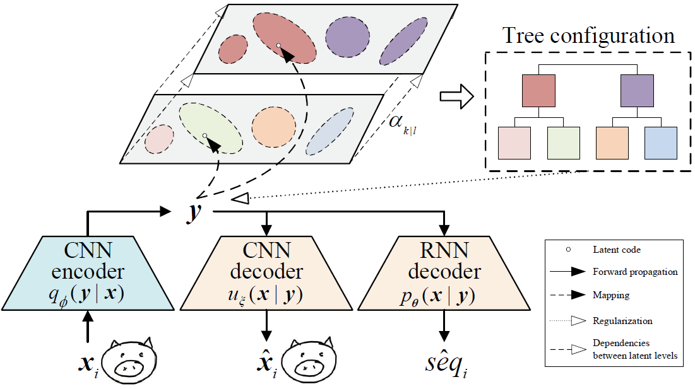

# RPCL-pix2seqH: Self-Organizing a Latent Hierarchy of Sketch Patterns for Controllable Sketch Synthesis

[RPCL-pix2seq](https://www.sciencedirect.com/science/article/abs/pii/S0893608021000149) ([source codes](https://github.com/CMACH508/RPCL-pix2seq)) encodes sketches as Gaussian mixture model (GMM)-distributed latent codes, and each Gaussian component represents a specific sketch pattern. But RPCL-pix2seq neglects the relationships between sketch patterns in latant space self-organization, as it treats the latent Gaussians as individual clusters. As the relationships between sketch patterns are important messages to reveal cognitive knowledge in sketch data, it is promising to learn accurate sketch representations by modeling these relationships into the latent structure, e.g., by self-organizing a latent hierarchy of sketch patterns as the newly proposed RPCL-pix2seqH.

This repo contains the source codes for `RPCL-pix2seqH`, and its correspondig article ([early access version](https://ieeexplore.ieee.org/abstract/document/10144693)) was accepted by ***IEEE Transactions on Neural Networks and Learning Systems*** in May, 2023, and is with the authors: Sicong Zang, Shikui Tu and Lei Xu from Shanghai Jiao Tong University.

# Overview

RPCL-pix2seqH constructs a tree-structured hierarchy over the clusters of sketch patterns. The hierarchy is stacked by two levels and both levels share the same GMM distribution over sketch codes. The basic units in the lower level-*k* are the Gaussian components in GMM, which represent the more specific descriptions of sketch patterns. According to the inheritance of patterns from common ancestors, the Gaussians in level-*k* are related to form the units in the upper level-*l* as the more general patterns. We regularize sketch codes with the latent hierarchy by structural constraint to learn efficient and accurate sketch representations.



# Training an RPCL-pix2seqH

## Dataset

Before training an RPCL-pix2seqH, you need a pixel-formed sketch dataset rasterized from [QuickDraw dataset](https://quickdraw.withgoogle.com/data), with the sketch image size of **48x48x1** following the setting in RPCL-pix2seq. The codes for sketch image translation are available at [link](https://github.com/CMACH508/RPCL-pix2seq).

## Required environments

1. Python 3.6
2. Tensorflow 1.12

## Training
```
python train.py --log_root=checkpoint_path --data_dir=dataset_path --resume_training=False --hparams="categories=[bee,bus], dec_model=hyper, batch_size=128"
```

`checkpoint_path` and `dataset_path` denote the model saving dir and the dataset dir, respectively. For the `hparams`, we provide a list of full options for training RPCL-pix2seqH, along with the default settings:
```
categories=['bee', 'bus'],         # Sketch categories for training
num_steps=1000001,                 # Number of total steps (the process will stop automatically if the loss is not improved)
save_every=1,                      # Number of epochs per checkpoint creation
dec_rnn_size=2048,                 # Size of decoder
dec_model='hyper',                 # Decoder: lstm, layer_norm or hyper
max_seq_len=-1,                    # Max sequence length. Computed by DataLoader
z_size=128,                        # Dimension of latent code
batch_size=128,                    # Minibatch size
num_mixture=5,                     # Recommend to set to the number of categories
learning_rate=0.001,               # Learning rate
decay_rate=0.9999,                 # Learning rate decay per minibatch.
min_learning_rate=0.00001,         # Minimum learning rate
grad_clip=1.,                      # Gradient clipping
de_weight=0.5,                     # Weight for deconv loss
use_recurrent_dropout=True,        # Dropout with memory loss
recurrent_dropout_prob=0.90,       # Probability of recurrent dropout keep
use_input_dropout=False,           # Input dropout
input_dropout_prob=0.90,           # Probability of input dropout keep
use_output_dropout=False,          # Output droput
output_dropout_prob=0.9,           # Probability of output dropout keep
random_scale_factor=0.10,          # Random scaling data augmention proportion
augment_stroke_prob=0.10,          # Point dropping augmentation proportion
png_scale_ratio=0.98,              # Min scaling ratio
png_rotate_angle=0,                # Max rotating angle (abs value)
png_translate_dist=0,              # Max translating distance (abs value)
is_training=True,                  # Training mode or not
png_width=48,                      # Width of input sketch images
num_sub=2,                         # Init number of components for each category
semi_percent=0.0,                  # Percentage of the labeled samples
semi_balanced=False,               # Whether the labeled samples are balanced among all categories
num_per_category=70000             # Training samples from each category
```

We also provide a pretrained RPCL-pix2seqH model on an 8-categorized dataset (bee, bus, car, cat, flower, giraffe, horse and pig), and you can find it in [link](https://pan.baidu.com/s/1VTG1Penyfr3DYMsdnAujig?pwd=5JW8).

## Generating
```
python sample.py --model_dir=checkpoint_path --output_dir=output_path --num_per_category=300 --conditional=True
```

With a trained model, you can generate sketches with sketch images input as conditions or not. For the `conditional` mode, the category and style of the generated sketches each are conditional on a sketch reference, which is randomly selected from the test set. And for the `unconditional` mode, the generated sketch corresponds to the latent code you set in `sample.py` before starting.

`num_per_category` denotes the number of generated sketches per category, and the generated sketches with their corresponding latent codes and Gaussian component indexes are stored in `output_path`. 

# Visualing the latent hierarchy
```
python visualization.npy
```

After generating several sketches via `sample.npy`, you can visualize the latent hierarchy via [*t*-SNE algorithm](https://www.jmlr.org/papers/volume9/vandermaaten08a/vandermaaten08a.pdf?fbcl). By running `visualization.npy`, you get an image named **result.jpg** for mapping all the generated sketches onto a two-dimensional space, an image named **level_k.jpg** for revealing the assignments on the hierarchical level-*k* and an image named **level_l.jpg** for revealing the assignments on the hierarchical level-*l*.


The figure above shows a latent hierarchy learned by our RPCL-pix2seqH on an 8-categorized dataset (bee, bus, car, cat, flower, giraffe, horse and pig). You can figure out that different sketch patterns are clustered in bottom level-*k*, and the ones with analogous relationships are grouped into the same component in top level-*l*. It indicates that the clusters at the same rank relate to each other through the inheritance of features of common ancestors, e.g., horses and giraffes heading left (or right) are grouped in level-*l* to form the more general pattern "animal heading left (or right)". And finally, we can obtain a tree configuration of sketch patterns, shown below, translated from the learned latent hierarchy.


# Sketch analogy

Sketch analogy is an application of synthesis reasoning ([link A](http://www.cnki.com.cn/Article/CJFDTotal-MSSB199603000.htm) and [link B](https://d.wanfangdata.com.cn/periodical/zjdxxbc-e202004005)), by utilizing latent calculators in the latent space to generate sketch flexibly. We explore sketch analogy by capturing specific latent calculator(s) for operating sketch synthesis, e.g., using the calculator of "adjusting orientation" captured from giraffes to "mirror" sketches. More details can be found in the article.


# Citation
If you find this project useful for academic purposes, please cite it as:
```
@Article{RPCL-pix2seqH,
  Title                    = {Self-Organizing a Latent Hierarchy of Sketch Patterns for Controllable Sketch Synthesis},
  Author                   = {Sicong Zang and Shikui Tu and Lei Xu},
  Journal                  = {IEEE Transactions on Neural Networks and Learning Systems},
  Doi                      = {https://doi.org/10.1109/TNNLS.2023.3279410}
}
```
